# **Software Requirements Specification (SRS) – Industrial Gas Turbine Compressor Dashboard**
**Version:** **11.0 (Final Comprehensive Requirements)**

---

## **1. Introduction**

### **1.1 Purpose**
This document defines the **final and unified software requirements** for the **Industrial Gas Turbine Compressor (IGT-12MW Class) Dashboard**. The system is a complete solution for monitoring, predictive maintenance, and **closed-loop optimization**, integrating Cloud AI, Edge AI, a Digital Twin, and robust Data Governance.

### **1.2 Scope**
The comprehensive scope includes:
- **Core Analytics:** **RTM**, **PdM**, and **DVR**.
- **Advanced Control:** **RTO** with **Direct Closed-Loop Control** and **Digital Twin Validation**.
- **Data Architecture:** **Kafka** streaming, **InfluxDB** storage, and full MLOps/DevOps pipeline.
- **Observability:** **Prometheus** for metrics and **Grafana** for dashboarding.
- **Governance:** Enforcement of Data Quality and Data Lineage policies.
- **Quality Assurance:** Mandatory implementation of **Unit Testing**.

### **1.3 Definitions & Acronyms**
| Term | Definition |
| :--- | :--- |
| **RTM** | **Real-Time Monitoring**: Live detection and visualization of current operating conditions. |
| **RTO** | **Real-Time Optimization**: Dynamic calculation and execution of optimal control setpoints. |
| **DVR** | **Data Validation and Reconciliation**: Process of detecting and correcting faulty sensor readings. |
| **PdM** | **Predictive Maintenance**: Forecasting equipment failures and Remaining Useful Life (RUL). |
| **Data Governance** | Management of data availability, usability, integrity, and security. |
| **Kafka** | Apache Kafka: Distributed streaming platform. |
| **InfluxDB** | High-performance Time-Series Database. |
| **Digital Twin** | A virtual replica of the physical compressor for simulation. |
| **Unit Test** | Automated testing of the smallest testable parts of an application ($\ge 85\%$ coverage). |

### **1.4 IGT-12MW Class Operational Profile (Generic Specifications)**
The system manages a twin-shaft gas turbine compressor in the 12-15 MW class, focusing on: Power Output ($\approx 12 - 15 \text{ MW}$), Pressure Ratio ($\approx 16:1 \text{ to } 18:1$), and Turbine Speed ($\approx 9,500 - 12,000 \text{ rpm}$).

---

## **2. Overall Description & Architecture**

### **2.1 System Overview**
The architecture is centered around **Kafka** for high-throughput streaming and **InfluxDB** for time-series storage. **Prometheus** and **Grafana** ensure observability. The system handles **Generated Data** (synthetic) and enforces strict **Data Governance** policies.

### **2.2 Data Segmentation & Management**
| Data Segment | Description | Storage/Purpose |
| :--- | :--- | :--- |
| **Sensor Data (Raw/Validated)** | High-frequency time-series data streams. | **InfluxDB** |
| **Historical Data** | Aggregated, audited data for long-term reports. | **MySQL/S3** |
| **Generated Data** | Synthetic data used for model training and simulation. | Separate Kafka Topic/S3 |

**FR-231 (Extensibility):** The system **shall** support configuration-based integration of new IGT units or external data sources (OPC-UA, MQTT) into the **Kafka** pipeline.

---

## **3. Functional Requirements**

### **3.1 Real-Time Monitoring (RTM) – Dual-Layer**
- **FR-311 (Cloud RTM):** Display live Sensor Data from **InfluxDB** with $\le 1$ second latency.
- **FR-312 (Edge AI RTM):** **RTM** Anomaly Detection models **shall** be deployed on **Edge Devices** (ONNX format) for local inference ($\le 100 \text{ms}$).

### **3.2 Predictive Maintenance (PdM)**
- **FR-321:** Forecast **RUL** for bearings, blades, and liners using **LSTM/Transformer** networks.
- **FR-322:** Provide actionable maintenance recommendations.

### **3.3 Data Validation & Reconciliation (DVR) and Data Quality**
- **FR-331 (Validation):** The **DVR** module **shall** enforce real-time **Data Quality** checks (range, completeness) and detect faulty sensors.
- **FR-332 (Reconciliation):** Reconcile data via **WLS** and publish the corrected stream back to the **Kafka** pipeline.

### **3.4 Real-Time Optimization (RTO) – Closed-Loop with Digital Twin**
- **FR-341:** The **RTO** module **shall** calculate optimal control setpoints using **MPC** and RL.
- **FR-342 (Digital Twin Validation):** The **RTO** output **shall** be simulated by the integrated **Digital Twin** to validate the predicted outcome **before** execution.
- **FR-343 (Direct Control):** Upon validation and Engineer approval, the **RTO** module **shall** execute parameter changes via a secured **OPC-UA Client** in a **Closed-Loop** manner.

### **3.5 Data Requirements and Sensor List (Mandatory Inputs)**
The system **shall** ingest and process high-frequency data points required for **RTM**, **PdM**, **DVR**, and **RTO**, including: **RPM**, **Torque**, **Temperature** ($\text{T}_{\text{in}}$, $\text{T}_{\text{exh}}$), **Pressure** ($\text{P}_{\text{in}}$, $\text{P}_{\text{out}}$), **Flow**, **Vibration** (Axial/Radial), **Actuator Position** (IGV), and **Emissions** (NOx/CO).

---

## **4. Non-Functional Requirements**

### **4.1 Security**
| Requirement | Description |
| :--- | :--- |
| **NF-411 (Application)** | **JWT** authentication and **RBAC**. |
| **NF-412 (Kafka In-Transit)** | **SSL/TLS** encryption for all **Kafka** communication. |
| **NF-414 (Control Isolation)** | RTO's OPC-UA communication **shall** use unique, restricted credentials. |

### **4.2 Development & Quality Assurance**
| Requirement | Description |
| :--- | :--- |
| **NF-421 (Unit Testing)** | Mandatory **Unit Tests** for all code with **$\ge 85\%$ code coverage**. |
| **NF-422 (Integration Testing)** | Automated tests validating end-to-end data flow (Kafka $\to$ InfluxDB $\to$ Flask API). |
| **NF-423 (Performance)** | **Kafka** consumer lag $\le 1$ second; API latency $\le 500$ milliseconds. |

### **4.3 DevOps/MLOps & Observability**
| Requirement | Description |
| :--- | :--- |
| **NF-431 (CI/CD)** | Full **CI/CD pipeline** for automated building, testing, and deployment (Kubernetes). |
| **NF-432 (MLOps - Tracking)** | Use **MLflow** for version control of models and **Generated Data** versions. |
| **NF-433 (Monitoring - Metrics)** | **Prometheus** **shall** be integrated to collect key metrics (CPU, Kafka Consumer Lag) from all microservices. |
| **NF-434 (Monitoring - Visualization)**| **Grafana** **shall** be deployed as the unified dashboarding tool, visualizing data from both **Prometheus** and **InfluxDB**. |

---

## **5. Data Governance Requirements**

### **5.1 Data Lineage and Auditability**
| Requirement ID | Requirement Description | Technical Details |
| :--- | :--- | :--- |
| **NF-511 (Lineage Logging)** | The system **shall** log the **Data Lineage** for all processed sensor readings, including source ID and the processing service (DVR, RTO) that modified the data. | Metadata tags within Kafka headers and specialized fields in the InfluxDB schema. |
| **NF-512 (Audit Trail)** | All data changes, especially those from **DVR** reconciliation or **RTO** execution, **shall** be recorded in an immutable audit log (**Historical Data** segment). | Store change records in MySQL (Original Value, Corrected Value, Algorithm ID). |

### **5.2 Data Ownership and Access**
| Requirement ID | Requirement Description | Technical Details |
| :--- | :--- | :--- |
| **NF-521 (Ownership Mapping)** | The system **shall** maintain metadata identifying the **Data Owner** responsible for each sensor group's accuracy. | Configurable mapping stored in the MySQL metadata database, linked to RBAC. |
| **NF-522 (Data Quality Reporting)** | A dedicated **Grafana** dashboard **shall** provide real-time reports on **Data Quality** metrics (e.g., frequency of **DVR** corrections, outlier rate). | Prometheus metrics scraped from the DVR service. |

---

## **6. Technical Implementation**

### **6.1 Core Stack**
- **UI/Frontend:** **React.js**.
- **Backend/API:** Python **Flask** (with Flask-SocketIO for WebSocket support).
- **Streaming Core:** **Apache Kafka**.
- **Time-Series DB:** **InfluxDB**.
- **Observability:** **Prometheus** and **Grafana**.

### **6.2 Advanced Subsystems**
- **Digital Twin:** Physics-based modeling, high-speed interaction for RL training.
- **Edge AI:** **RTM** models converted to **ONNX** format for local deployment.
- **SCADA:** **OPC-UA Client** for **RTO** control, and **OPC-UA Server** for publishing AI results.

---

## **7. AI/ML Frameworks and Testing Tools**

| Module | Core AI/ML Frameworks | Mandatory Unit Test Tools |
| :--- | :--- | :--- |
| **Cloud Intelligence** (PdM, RTO) | `TensorFlow`, `PyTorch`, `Scikit-learn`, `CasADi` | **Pytest** (for Python backend/ML logic) |
| **Frontend** (React.js) | N/A | **Jest** (for React components/UI logic) |


# **Software Requirements Specification (SRS) – Industrial Gas Turbine Compressor Dashboard**
**Version:** **13.0 (Final with Visual Diagrams)**

---

## **1. Introduction**

### **1.1 Purpose**
This document provides comprehensive software requirements for the Industrial Gas Turbine Compressor Dashboard with complete visual diagram specifications.

### **1.2 Scope**
End-to-end solution integrating Real-Time Monitoring, Predictive Maintenance, Data Validation, Real-Time Optimization, and Digital Twin technologies.

---

## **2. System Architecture Diagrams**

### **2.1 Overall System Architecture**

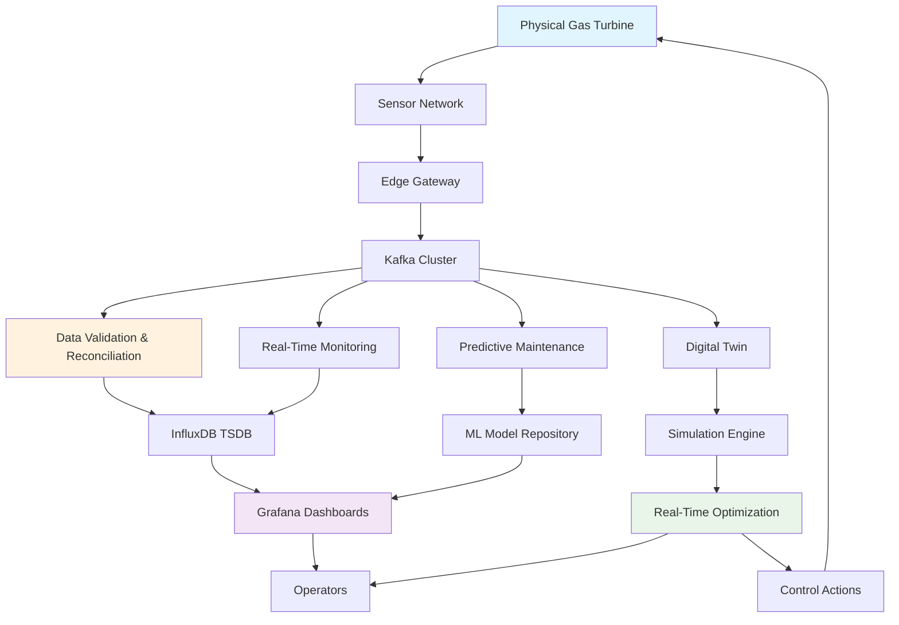

---

## **3. Core Functional Modules**

### **3.1 Real-Time Monitoring (RTM) Architecture**

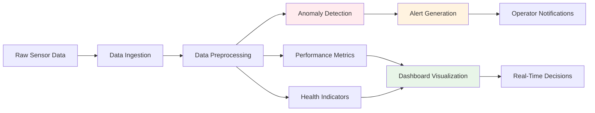

### **3.2 Predictive Maintenance (PdM) Framework**

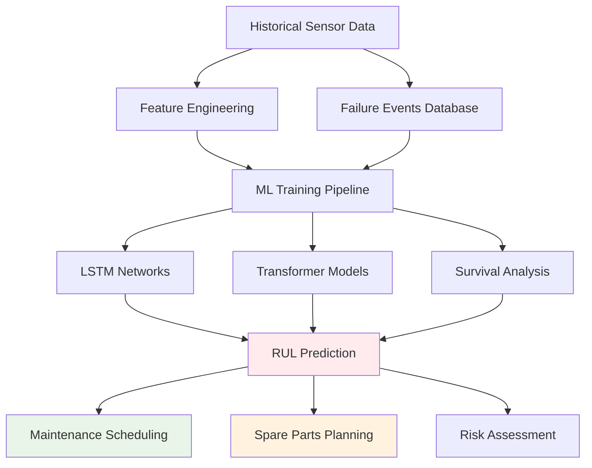

### **3.3 Data Validation & Reconciliation (DVR) System**

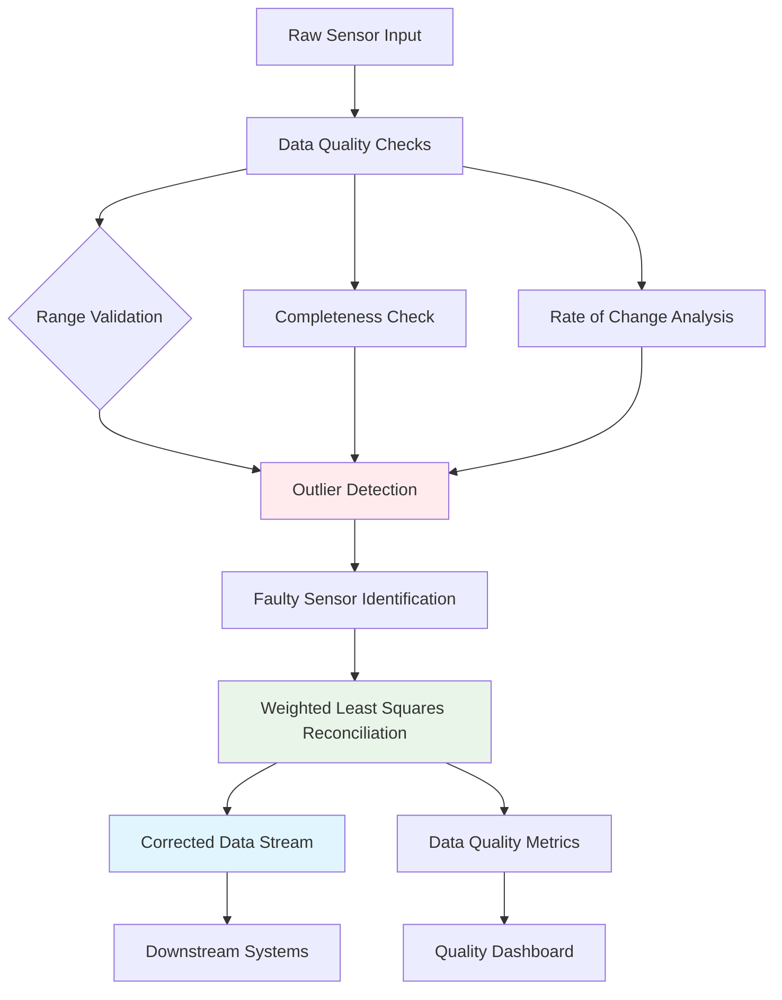

### **3.4 Real-Time Optimization (RTO) with Digital Twin**

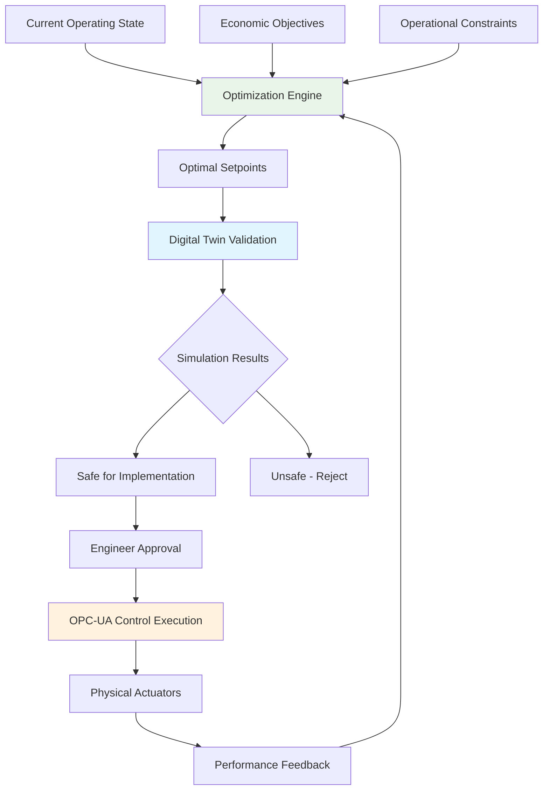

---

## **4. Data Pipeline & Streaming Architecture**

### **4.1 Kafka Streaming Infrastructure**

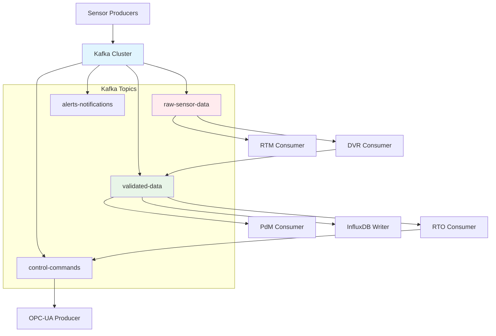

### **4.2 Monitoring & Observability Stack**

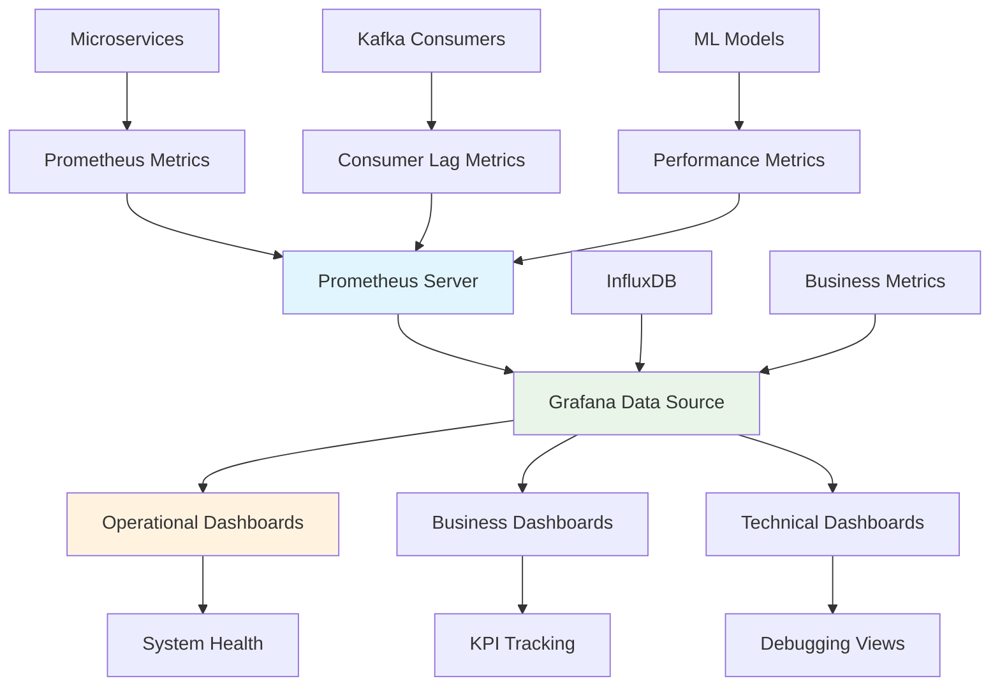

---

## **5. Data Governance Framework**

### **5.1 Data Lineage & Quality Management**

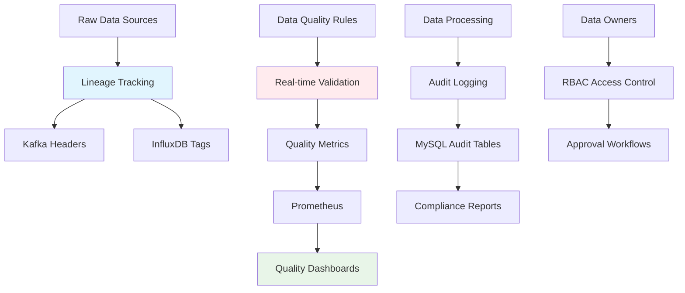

---

## **6. Security Architecture**

### **6.1 Comprehensive Security Layers**

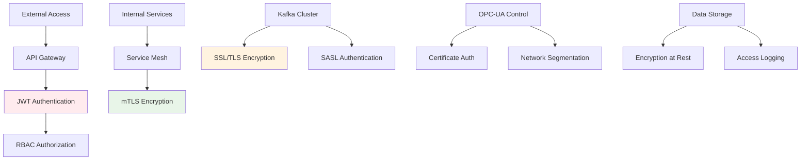

---

## **7. Deployment & DevOps**

### **7.1 CI/CD Pipeline Architecture**

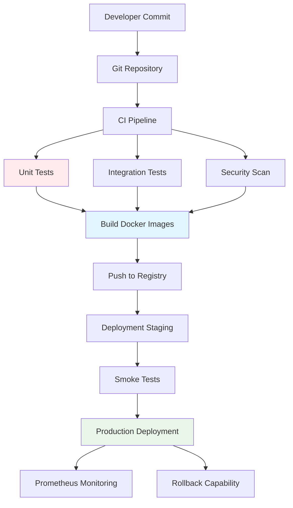

---

## **8. Performance Requirements**

### **8.1 System Performance Matrix**

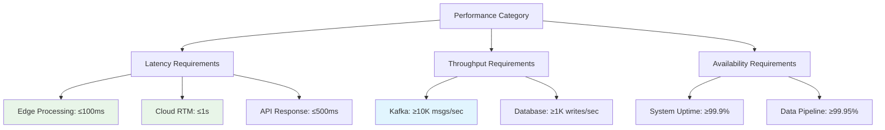

---

## **9. Appendices**

### **9.1 Technology Stack Specification**

```mermaid
graph TB
    A[Technology Stack] --> B[Frontend Layer]
    A --> C[Backend Layer]
    A --> D[Data Layer]
    A --> E[AI/ML Layer]
    A --> F[Infrastructure Layer]
    
    B --> G[React.js]
    B --> H[Grafana Embedded]
    
    C --> I[Python Flask]
    C --> J[FastAPI]
    
    D --> K[Apache Kafka]
    D --> L[InfluxDB]
    D --> M[MySQL]
    
    E --> N[TensorFlow]
    E --> O[PyTorch]
    E --> P[MLflow]
    
    F --> Q[Kubernetes]
    F --> R[Docker]
    F --> S[Prometheus]
    
    style G fill:#e1f5fe
    style K fill:#fff3e0
    style N fill:#e8f5e8
